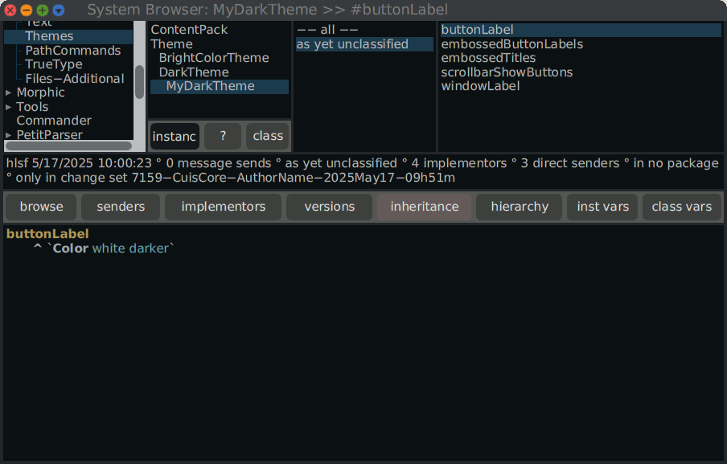

# How-to create a custom theme

Cuis comes with a hierarchy of `Theme` classes. In the stock Smalltalk
image there are the `BrightColorTheme`, the default one, and the
`DarkTheme` themes. To switch to a particular theme, execute in a
Workspace:

```smalltalk
DarkTheme beCurrent
```

To observer the result on a particular window, it needs to be closed
and opened again. 

**Hints.** On a Browser window, just click with the right mouse button
the **browse** button. This replace the current browser with a new
Browser with the same contents and extent.


Let's say you like the dark theme but you want to remove this blur
effect on the button, and remove the arrow buttons in the
scrollbar. Your create your own class `MyDarkTheme` from `DarkTheme`:

```smalltalk
DarkTheme subclass: #MyDarkTheme
	instanceVariableNames: ''
	classVariableNames: ''
	poolDictionaries: ''
	category: 'Graphics-Themes'
```

then override a few methods in `MyDarkTheme`:

```smalltalk
buttonLabel
	^ `Color white darker`
	
embossedButtonLabels
	^false

embossedTitles
	^false
	
scrollbarShowButtons
	^ false

windowLabel
	^ `Color white muchDarker`
```



To learn from what people are doing with themes, you can install a
package with a bank of themes from the World menu **World
Menu>Preferences>Load Additional Theme**

It is likely some parts of the GUI cannot be adjusted through a
dedicated theme. Under this circumstance, you should hack the system
to fill your needs then suggest a change set to the community.
